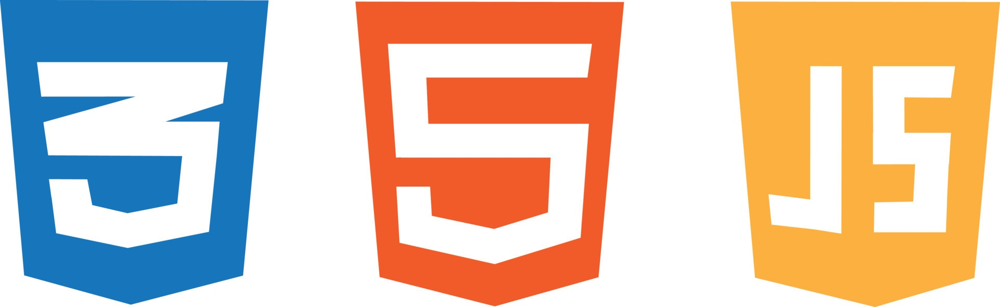

# Bienvenid@s a mi proyecto "Ricky_Api"
 
# [Haz click aqui para ver demo 🔗]( https://rickyapi.netlify.app/ )

### Contexto del proyecto (apernder a usar API)
Requisitos obligatorios:
* Desarrollar una página web con HTML, CSS, Javascript
* Consumir una API externa
* Mostrar los datos en tarjetas, tablas, etc
* Estar documentada con su respectivo README
* Utilizar Bootstrap o una librería de diseño

EXTRA:
* La sección está hecha con paginación
* Ver el detalles de un solo elemento
* Filtrar la información traída por la API
* Hacer Deploy en Github
* Consumir N APIs
* Crear un Json y consumir la información
* Validar con alguna función de Javascript el funcionamiento de la página (test)
* Consumir una API securizada (usuario y contraseña y token)

Criterios de rendimiento
● El alumno debe lograr explicar la mayoría del código.

#

Herramienta de organización:
+ [Trello]( https://trello.com/b/YGoGUCS4/consumo-de-una-api )
+ [Figma]( https://www.figma.com/file/P6Z2RGZVuZnqTZygjqu7Zu/Consumo-de-una-APInode-id=0-1&t=ZC0665siiBlLaDw7-0 )

#

Temporacización:
 + Inicio: 24/04/2023
 + Fin: 05/05/2023

## Tecnología

